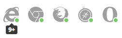

# another

> 简

[在线预览 Preview](http://qiutc.me)

# 使用

主要在于配置主题目录下的 ``_congig.yml`` 文件。
```yml
# when running hexo in a subdirectory (e.g. domain.tld/blog), remove leading slashes ( "/archives" -> "archives" )
# 导航菜单
menu:
  home: /
  categories: /categories
  tags: /tags
  about: /about

# the author and email
# 博客作者和email
author: TongchengQiu
email: TongchengQiu@gmail.com

# the picture of donation
# Place your donation.png to /source directory.
# 捐赠 ( 需要把图片放到 /source directory. )
donation: /img/donation.png

# Place your favicon.ico to /source directory.
# 网站图标－在 /source 文件夹下
favicon: /favicon.ico

# avatar
# Place your avatar.jpg to /source directory.
# 个人头像图片 /source 文件夹下
avatar: /img/qtc_avatar.jpg

# Set default keywords (Use a comma to separate)
# 默认的 key words
keywords: "^_^"

# Set rss to false to disable feed link.
# Leave rss as empty to use site's feed link.
# Set rss to specific value if you have burned your feed already.
rss:

# the date of setting up the blog
# 网站成立日期
birth_day: 10/04/2015

# the year of setting up the blog
# 成立的年
since: 2015

# Code Highlight theme
# Available value: normal | night | night eighties | night blue | night bright
# https://github.com/chriskempson/tomorrow-theme
# markdown 生成的代码高亮主题色
highlight_theme: normal

# Automatically Excerpt
# 首页的文章预览裁剪字数
auto_excerpt:
  enable: true
  length: 200

# virification code of baidu & google
# baidu & google 网站验证的验证码
google_site_verification: xxxxxxxxxx
baidu_site_verification: xxxxxxxxxx

# baidu & google analytics code
# 百度分析
baidu_analytics: xxxxxxxxxx
# google 分析
google_analytics: xxxxxxxxxx

# Make duoshuo show UA
# user_id must NOT be null when admin_enable is true!
# you can visit http://dev.duoshuo.com get duoshuo user id.
# 多说的服务信息
duoshuo_info:
  ua_enable: true
  admin_enable: false
  user_id: xxxxxxxxxx
  admin_nickname: xxxxxxxxxx
duoshuo_shortname: xxxxxxxxxx

# 如果你需要 disqus 的配置，请把上面的多说的配置注释或者去掉，加上
# disqus_shortname: your...

# Social links
# 社会化链接
social:
  github: https://github.com/tongchengqiu
  twitter: https://twitter.com/tongchengqiu
  zhihu: http://www.zhihu.com/people/tongchengqiu
  weibo: http://weibo.com/tongchengqiu

# firend links
# 友链
friends:
  阿城的blog: http://qiutc.me
  tip: (欢迎交换友链)

# Use Lato font
# Note: this option is avialable only when the language is not `zh-Hans`
# 在不是中文情况下是否适用字体
use_font_lato: true

# Static files
# 静态文件路径
vendors: vendors
css: css
js: js
images: images

# Theme version
# 主题版本
version: 0.0.2
```

网站根目录的配置，``_config.yml``，可以直接参考我的博客的配置：
[https://github.com/TongchengQiu/blog/tree/source](https://github.com/TongchengQiu/blog/tree/source)
或者看这篇文章: [使用hexo+github搭建静态博客
](http://qiutc.me/post/%E4%BD%BF%E7%94%A8hexo-github%E6%90%AD%E5%BB%BA%E9%9D%99%E6%80%81%E5%8D%9A%E5%AE%A2.html)
```yml
# Hexo Configuration
## Docs: http://hexo.io/docs/configuration.html
## Source: https://github.com/hexojs/hexo/

# 网站基本信息
title: title
subtitle: subtitle
description: description
author: author
language: zh-Hans
timezone: Asia/Shanghai

# URL 格式
url: http://yoursite.
root: /
permalink: post/:title.html
permalink_defaults:

# Directory 文件目录，一般不管
source_dir: source
public_dir: public
tag_dir: tags
archive_dir: archives
category_dir: categories
code_dir: downloads/code
i18n_dir: :lang
skip_render:

# Writing 写作格式
new_post_name: :title.md # File name of new posts
default_layout: post
titlecase: false # Transform title into titlecase
external_link: true # Open external links in new tab
filename_case: 0
render_drafts: false
post_asset_folder: false
relative_link: false
future: true
highlight:
  enable: true
  line_number: false
  auto_detect: true
  tab_replace:

# Category & Tag
default_category: uncategorized
category_map:
tag_map:

# Date / Time format 事件格式
## http://momentjs.com/docs/#/displaying/format/
date_format: YYYY-MM-DD
time_format: HH:mm:ss

# Pagination 分页数
## Set per_page to 0 to disable pagination
per_page: 5
pagination_dir: page

# Extensions 主题
## Plugins: http://hexo.io/plugins/
## Themes: http://hexo.io/themes/
theme: another

# Deployment github 的地址
## Docs: http://hexo.io/docs/deployment.html
deploy:
  type: git
  repository:
    github: git@yourgithub
  branch: gh-pages

# 插件
plugins:
- hexo-generator-sitemap
- hexo-generator-archive
- hexo-generator-tag

# Creative Commons 4.0 International License.
# http://creativecommons.org/
# Available: by | by-nc | by-nc-nd | by-nc-sa | by-nd | by-sa | zero
creative_commons: by-nc-sa

```

## 浏览器支持 Browser support




## 贡献 Contributing

接受各种形式的贡献，包括不限于提交问题与需求，修复代码。等待您的`Pull Request`。

Any types of contribution are welcome. Thanks.
